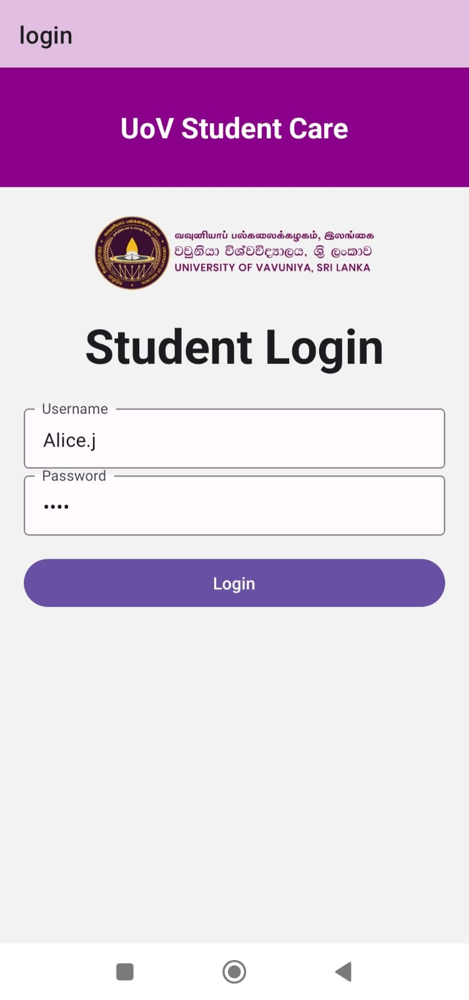
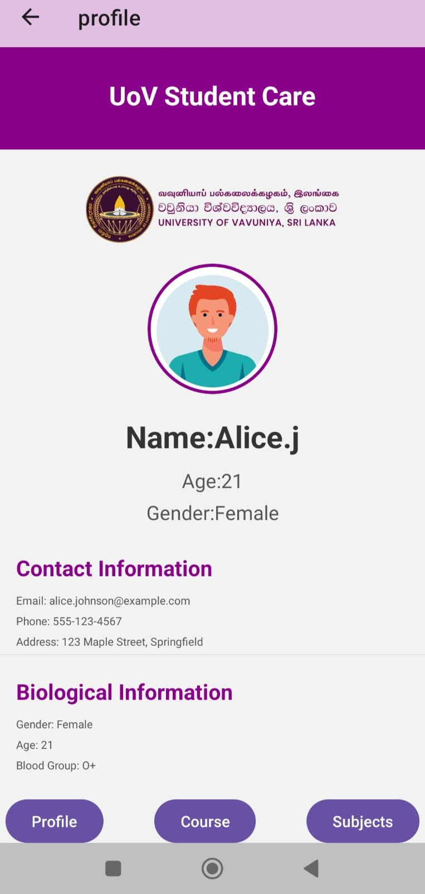
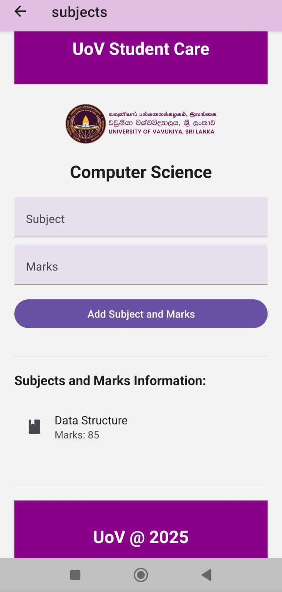

<h1>2020/ICT/30</h1>
<h1>Assignment 3</h1>

<h3>In this assignment we have to create student care mobile app using react native</h3>

Create Project:- npx create-expo-app studentcare --template

Run Project:-npm start

<table>
  <tr>
    <td style="border-right: 2px solid black; padding-right: 10px;">
      
    </td>
    <td style="padding-left: 10px;">
      
    </td>
    <td style="padding-left: 10px;">
      
    </td>
  </tr>
  <tr>
     <td style="padding-left: 10px;">
      
    </td>
  </tr>
</table>
